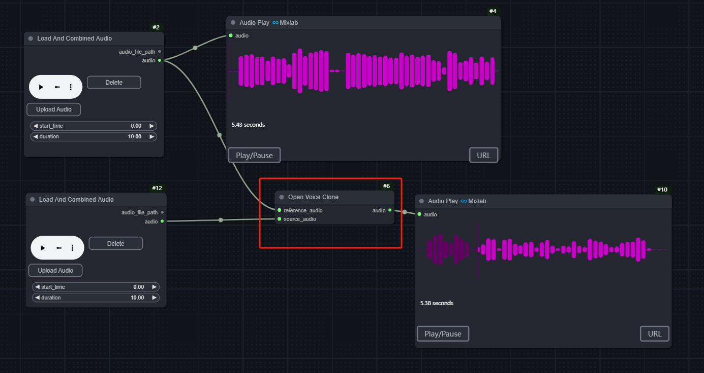

# Comfyui-ChatTTS
> [寻求帮助 Mixlab nodes discord](https://discord.gg/cXs9vZSqeK)

> [推荐：mixlab-nodes](https://github.com/shadowcz007/comfyui-mixlab-nodes)


目前可以创建音色，复用音色，支持多人对话模式的生成，寻求帮助可以加入[discord](https://discord.gg/cXs9vZSqeK)


> 案例 : 多人对话 x 脱口秀

[](https://www.youtube.com/embed/s6O9aKrr3pM?si=--mwIX1rR0axEQFn)


节点：

ChatTTS

Multi Person Podcast

CreateSpeakers

SaveSpeaker 、LoadSpeaker : 方便保存和加载音色,支持 [ChatTTS_Speaker/summary](https://modelscope.cn/studios/ttwwwaa/ChatTTS_Speaker/summary) 的音色加载


OpenVoiceClone ：方便迁移音色，更好地控制角色声音




模型：

下载后放到 ```models/chat_tts```

https://huggingface.co/2Noise/ChatTTS

音色pt文件放到```models/chat_tts_speaker```

[openvoice 模型](https://myshell-public-repo-hosting.s3.amazonaws.com/openvoice/checkpoints_v2_0417.zip)放到```models/open_voice```


> 分支是一个课程的示例代码:以ChatTTS为例，为ComfyUI增加语音合成功能。一个自定义的节点需要完成：
python 运行时（后端）- 后端python怎么写
GUI - 怎么修改节点界面


