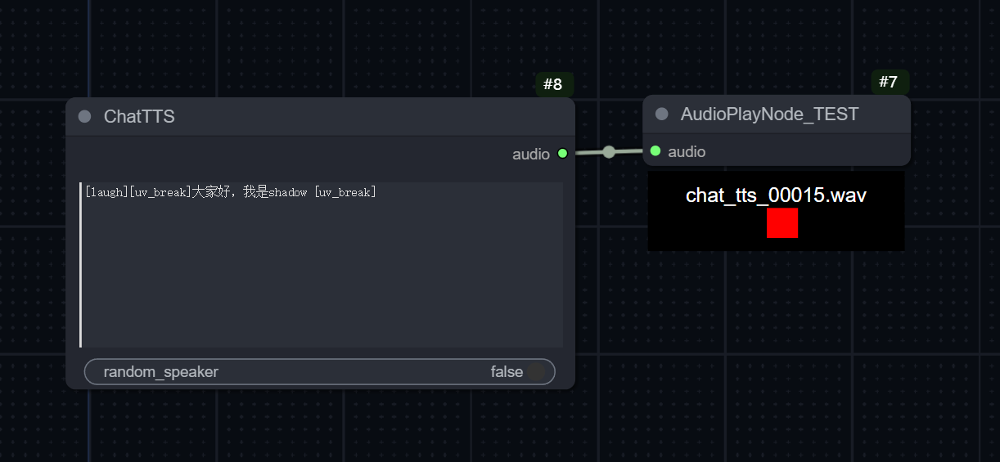

# Comfyui-ChatTTS

> 这是一个课程的示例代码

以ChatTTS为例，为ComfyUI增加语音合成功能。

一个自定义的节点需要完成：
python 运行时（后端）- 后端python怎么写
GUI - 怎么修改节点界面

TODO:
中英文处理
https://github.com/jianchang512/ChatTTS-ui/blob/main/uilib/utils.py